```{r setup, include=FALSE}
options(htmltools.dir.version = FALSE)

syl_icons <- icons::icon_set("./assets/icons")
syl_images <- icons::icon_set("./assets/images")
```

```{r xaringan-themer, include=FALSE, warning=FALSE}
library(xaringanthemer)
# Custom theme reference: https://pkg.garrickadenbuie.com/xaringanthemer/reference/style_xaringan.html
style_xaringan(
  # fonts
  header_font_google = google_font("Nunito", "300", "400", "500", "600", "700", "400i", "500i", "600i", "700i"),
  text_font_google   = google_font("Nunito", "300", "300i", "400", "400i", "500", "500i", "600"),
  code_font_google   = google_font("Source Code Pro"),
  # global
  text_color = "#1E1E24",
  link_color = "#39627F",
  background_color = "#F6F7F8",
  inverse_background_color = "#4C82A9",
  inverse_text_color = "#FFF",
  inverse_header_color = "#FFF",
  # code_inline_background_color = "#ddd",
  header_h1_font_size = "1.5em",
  header_h2_font_size = "1.25em",
  header_h3_font_size = "1.1em",
  header_font_weight = "400",
  base_font_size = "24px",
  # title slide
  title_slide_text_color = "#1E1E24",
  title_slide_background_image = "assets/images/title-slide-background.svg",
  title_slide_background_size	= "contain",
  title_slide_background_color = "#F6F7F8",
  title_slide_background_position = "50% 75%",
  colors = c(
    primary = "#4C82A9",
    orange = "#DA7652",
    green = "#65C367"
  )
)
```

```{r load-packages, message=FALSE, echo=FALSE}
library(metathis)
library(ggplot2)
library(dplyr)
library(icons)
```

```{r meta, echo=FALSE}
meta() %>%
  meta_general(
    description = "Slides for a presentation to the Coman Lab on best practices for modern social science",
  ) %>% 
  meta_name("github-repo" = "startyourlab/workshop") %>% 
  meta_social(
    title = "Best practices for modern social science",
    url = "https://workshops.startyourlab.com/coman-lab-meeting-slides",
    image = "https://workshops.startyourlab.com/coman-lab-meeting-slides/assets/images/og-image-large.png",
    image_alt = "Start Your Lab Open Graph Image",
    og_type = "website",
    og_author = "Start Your Lab",
    twitter_card_type = "summary_large_image",
    twitter_creator = "@startyourlab"
  )
```

class: title-slide

<div align="center" style="margin-bottom: 2em;">
  
</div>

<div align="center" class="header">
  <h1 class="title">Best practices for<br/>modern social science</h1>
</div>

<div class="footer">
  <div class="authors">
    <div class="author">
      <p class="name">Ari Dyckovsky</p>
      <a class="twitter" href="https://twitter.com/adyckovsky">@adyckovsky</a>
    </div>
  </div>
</div>

---
class: left

# Today's Agenda

1. What does modern social science look like?
2. Why are we here today?
3. What are best practices and why are they important?
4. How do we get our lab started with best practices for teams?
5. How do we leverage modern tools as a lab? a department? a field?

---
class: center, middle, inverse

# What does modern social science look like?

---
class: left

<div style="position: absolute; top: 20px; right: 20px; text-align: right;">
  `r icon_style(syl_icons$unlock, height = "2em")` 
</div>

# Open science is increasingly emphasized

- Collaboration between teams and fields
- Reusing others’ materials and reproducing findings
- Public accessibility
- Many powerful drivers
  - Journals, funders, individuals, scientific societies

---
class: left

<div style="position: absolute; top: 20px; right: 20px; text-align: right;">
  `r icon_style(syl_icons$maze, height = "2em")` 
</div>

# Complex problems need computing resources

- Experiments are more powerful, creative, and complex
- Analyses increasingly rely on computationally-intensive approaches

---
class: left

<div style="position: absolute; top: 20px; right: 20px; text-align: right;">
  `r icon_style(syl_icons$network, height = "2em")` 
</div>

# Global networks are more common

- Academics are increasingly working with people outside their lab, department, university, or even academia itself.
- If people leave academia for the private sector, <i>wherever they go</i>, the best possible practices are used and expected.
  - Facilitating better research practices is good for academics, increasingly common in academia, and crucial outside of academia

---
class: center

# Modern social science looks like...

<div style="margin-top: 10%; display: flex; flex-direction: row; height: 70%; justify-content: space-evenly; align-items: center;">
  <div style="display: flex; flex: 1; flex-direction: column; justify-content: space-between; align-items: stretch; height: 100%; border: 0.1em solid transparent; border-radius: 0.5em; background-color: transparent; padding: 1em 0;">
    <div>
      `r icon_style(syl_icons$unlock, height = "3em")`
      <p class="icon-label">Open Science</p>
    </div>
    <div>
      `r icon_style(syl_icons$maze, height = "3em")`
      <p class="icon-label">Complex Problems</p>
    </div>
    <div>
      `r icon_style(syl_icons$network, height = "3em")`
      <p class="icon-label">Global Networks</p>
    </div>
  </div>
  <div style="flex: 0; opacity: 0">
    `r icon_style(syl_icons$right_arrow, scale = 2, fill = "#383843")`
  </div>
  <div style="display: flex; flex: 1; flex-direction: column">
    <div style="opacity: 0;">
      `r icon_style(syl_icons$group, height = "6em")`
      <h3 class="icon-label">Team Science</h3>
    </div>
  </div>
</div>
---
class: center

# Modern social science looks like...

<div style="margin-top: 10%; display: flex; flex-direction: row; height: 70%; justify-content: space-evenly; align-items: center;">
  <div style="display: flex; flex: 1; flex-direction: column; justify-content: space-between; align-items: stretch; height: 100%; border: 0.1em solid #93D595; border-radius: 0.5em; background-color: #EAF7EA; padding: 1em 0;">
    <div>
      `r icon_style(syl_icons$unlock, height = "3em")`
      <p class="icon-label">Open Science</p>
    </div>
    <div>
      `r icon_style(syl_icons$maze, height = "3em")`
      <p class="icon-label">Complex Problems</p>
    </div>
    <div>
      `r icon_style(syl_icons$network, height = "3em")`
      <p class="icon-label">Global Networks</p>
    </div>
  </div>
  <div style="flex: 0; opacity: 1">
    `r icon_style(syl_icons$right_arrow, scale = 2, color = "#93D595")`
  </div>
  <div style="display: flex; flex: 1; flex-direction: column">
    <div style="opacity: 1;">
      `r icon_style(syl_icons$group, height = "6em")`
      <h3 class="icon-label">Team Science</h3>
    </div>
  </div>
</div>
---
class: center, middle, inverse

# Why are we here today?

---
class: left

# We can't keep track of different versions

_How often do you store and spend time searching for file versions?_

```{r, echo=FALSE, fig.retina=2, out.width='80%', fig.width=8, fig.height=6, fig.align='center'}
data <- data.frame(
  group = c(1, 2, 3, 4, 5),
  value = c(3, 3, 3, 4, 2)
) 

ggplot(data, aes(x=group, y=value)) +
  geom_bar(stat="identity", width=0.7, fill="#4C82A9") +
  theme_classic() +
  theme(
    text = element_text(size=24, family = "Nunito"), 
    axis.title.x = element_blank(),
    axis.title.y = element_blank()
  ) +
  scale_x_discrete(
    limits = c("Not at all", "", "Sometimes", "","All the time")
  ) +
  theme_xaringan()

```

---
class: left

# We can't find files confidently

_How organized do you feel your project files are?_

```{r, echo=FALSE, fig.retina=2, out.width='80%', fig.width=8, fig.height=6, fig.align='center'}
data <- data.frame(
  group = c(1, 2, 3, 4, 5),
  value = c(1, 1, 7, 6, 0)
) 

ggplot(data, aes(x=group, y=value)) +
  geom_bar(stat="identity", width=0.7, fill="#4C82A9") +
  theme_classic() +
  theme(
    text = element_text(size=24, family = "Nunito"), 
    axis.title.x = element_blank(),
    axis.title.y = element_blank()
  ) +
  scale_x_discrete(
    limits = c("Not at all", "", "Neutral", "","Perfectly")
  ) +
  theme_xaringan()

```

---
class: left

# We can't share without extra effort

_Are you able to share analysis files with collaborators with one or two clicks without doing any editing to the file?_

```{r, echo=FALSE, fig.retina=2, out.width='60%', fig.align='center'}
data <- data.frame(
  group = c("Yes", "No"),
  value = c(5, 10)
) 

data <- data %>% 
  arrange(desc(group)) %>%
  mutate(prop = value / sum(data$value) *100) %>%
  mutate(ypos = cumsum(prop)- 0.5*prop )

ggplot(data, aes(x="", y=prop, fill=group)) +
  geom_bar(stat="identity", width=1, color="white") +
  coord_polar("y", start=0) +
  geom_text(aes(y = ypos, label = paste0(group, "\n", round(prop), "%")), color = "white", size=8) +
  scale_fill_manual(values = c("#DF8768", "#4C82A9")) +
  theme_xaringan() +
  theme(
    legend.position="none",
    axis.text = element_blank(),
    axis.title = element_blank()
  )
```

---
class: left

# Continuing current research practices has costs

1. They are expensive in both time and effort

--

  - This is **.orange[hours of your time and others’ time, wasted]**.
  
--

2. They lead to risk of serious errors

--

  - This is **.orange[mistakes in publications and unnecessary confusion]**.
  
--

3. They make collaboration harder than it needs to be

--

  - This is **.orange[lost opportunities and lost innovation]**.

---
class: center, middle

# .primary[**We can do better by using _best practices_**]

---
class: center, middle, inverse

# What are best practices and <br/> why are they important?

---
class: left

# Best practices are...

- methods
- strategies
- techniques
- procedures
- etc.

## ...that are generally agreed upon as the <br/> **most effective** or **most prudent** way to work.

--

<div align="center" style="padding: 1em; margin-top: 2em; border: 0.1em solid #5D8EB1; border-radius: 0.5em; background-color: #E8EFF4;">
  <h2>Best practices are vital to successful collaboration with your team, projects, and code.</h2>
</div>

---
class: left

# Examples of best practices

1. Decouple data from programs

--

2. Write programs for people, not for computers

--

3. Track changes using version control

--

4. Coordinate updates using an issue tracking tool

--

5. Don't repeat yourself (or others)

--

6. Automate repeat tasks

--

## There are _many more_ best practices. 

_See: https://www.startyourlab.com/community/resources_

---
class: left

# Who agrees upon these "best" practices?

--

## The private sector

...especially those in .primary[**software and technology**] who carry out their entire professional lives in this setting with tremendous incentives & desire to improve, streamline, and facilitate digital work.

---
class: left

# Who agrees upon these "best" practices?

## Other academics

.pull-left[

.small-font[

Ram, 2013, Git can facilitate greater reproducibility and increased transparency in science, _Source Code for Biology and Medicine_

Wilson et al, 2014, Best practices for scientific computing, _PLoS Biology_

Gorgolewski & Poldrack, 2016, A practical guide for improving transparency and reproducibility in neuroimaging research, _PLoS Biology_

**.green[Lowndes et al, 2017, Our path to better science in less time using open data science tools, _Nature Ecology & Evolution_]**

Wilson et al, 2017, Good enough practices in scientific computing, _PLoS Computational Biology_

Hesse, 2018, Can psychology walk the walk of open science?, _American Psychologist_

]

]

--

.pull-right[
<div style="margin-top: 3em; padding: 1em; background-color: white; border: 0.1em solid #65C367; border-radius: 0.5em;" />

]

---
class: left

# What is the value of adopting best practices?

--

## .primary[Best practices are consistent with **our scientific values**]

--

.pull-left[

- Better science
  - More reusability
  - More reproducibility
  - Fewer errors
- Transparency
- Efficiency

]

--

.pull-right[

- More attractive collaborator
- Fast onboarding of new lab members
- Supports young scholars
- Intentional organization of digital lab materials

]

--

<div align="center" style="padding: 1em; margin-top: 2em; border: 0.1em solid #E29377; border-radius: 0.5em; background-color: #F9EAE4;">
  <h2>Future-proofing</h2>
  <h3>This is and will be the standard for years to come</h3>
</div>

---
class: center, middle, inverse

# How do we get our lab started <br/> with best practices for teams?

---
class: center, middle

# **.primary[It starts with the best tools for teams]**

---
class: left

<div style="position: absolute; top: 20px; right: 20px; text-align: right;">
  `r icon_style(syl_images$slack_logo, height = "2em")` 
</div>

# Start **communicating** with Slack

--

- Can be asynchronous, can be synchronous
- Designed for teams with multiple people coordinating unevenly across multiple projects in shifting ways over time
- Can be 1:1 private, shared within a small group, or shared with everyone, all within the same platform
- Stores your communication and makes it easy to find later
- Connects with nearly every other modern tool for teams

--

## **Who else uses Slack?**

### As of 2019, Slack had .primary[**10+ million daily active users**], and 87% of users state that Slack improves their entire work process

---
class: left

<div style="position: absolute; top: 20px; right: 20px; text-align: right;">
  `r icon_style(syl_images$google_calendar_logo, height = "2em")` 
</div>

# Start **scheduling** with Google Calendar

--

- Designed for teams with multiple projects and various meeting needs
- Both public and private calendar events to schedule weekly lab meetings and one-on-one meetings
- It is more accessible for external collaborators than Outlook

--

## **Who else uses Google Calendar?**

### As of 2018, at least .primary[**500 million people**] use Google Calendar

---
class: left

<div style="position: absolute; top: 20px; right: 20px; text-align: right;">
  `r icon_style(syl_images$github_logo, height = "2em")` 
</div>

# Start **developing** with GitHub
--

- Provides a shared interface for all digital materials in the cloud
- Relates ideas and conversation directly to code
- Tracks informative, detailed changes line-by-line, file-by-file, folder-by-folder
- Designed explicitly for teams who write code of _any_ kind
- Resolves conflicts between different peoples’ materials
- Facilitates discussion and planning about those digital materials

--

## **Who else uses GitHub?**

### As of 2021, GitHub had .primary[**69+ million accounts**] from across the whole world and 200+ million repositories

---
class: center

<div style="text-align: center;">
  `r icon_style(syl_images$github_logo, height = "3em")` 
</div>

# How does GitHub work?

--

<div align="center" style="padding: 1em; margin-top: 2em; border: 0.1em solid #FFF07C; border-radius: 0.5em; background-color: #FFF9D1;">
  <h2>GitHub uses a <b>version control system</b> called <i>Git</i>.<br/><br/>Let's take a look!</h2>
</div>

---
class: center, middle, inverse-black

# Conceptual flow

---
class: left

# Here is your main idea

<div align="center" style="margin-bottom: 2em;">
  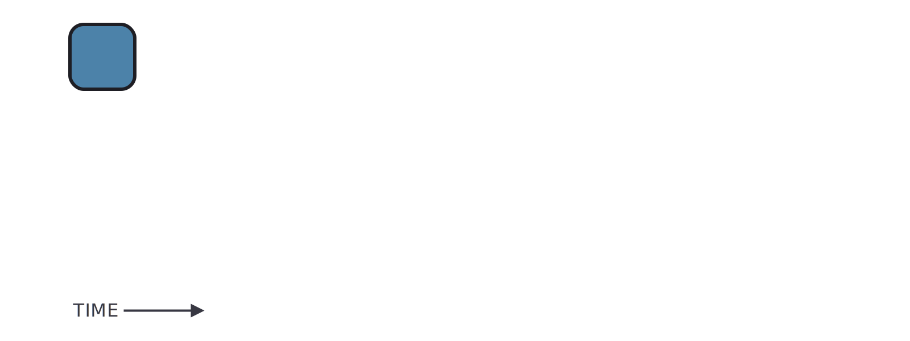
</div>

---
class: left

# Make a quick update to your main idea

<div align="center" style="margin-bottom: 2em;">
  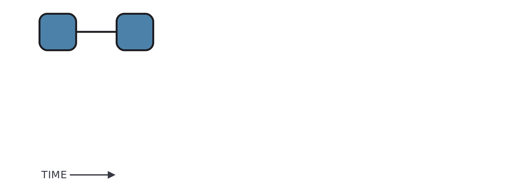
</div>

---
class: left

# Draft a new idea separate from your main idea

<div align="center" style="margin-bottom: 2em;">
  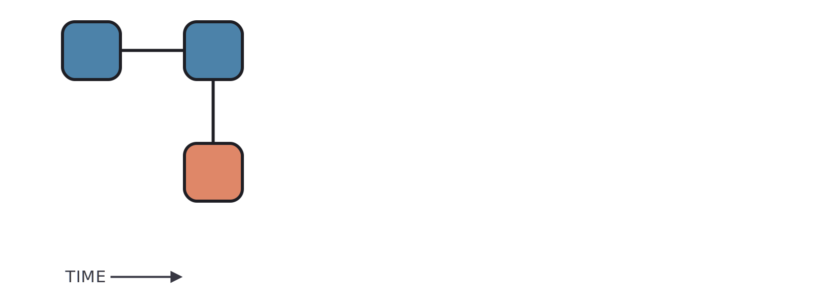
</div>

---
class: left

# Iterate on the draft of your new idea

<div align="center" style="margin-bottom: 2em;">
  
</div>

---
class: left

# Continue developing the new idea

<div align="center" style="margin-bottom: 2em;">
  
</div>

---
class: left

# Make one more update to the new idea

<div align="center" style="margin-bottom: 2em;">
  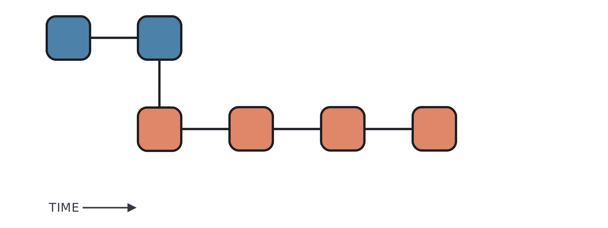
</div>

---
class: left

# Update your main idea with the new idea

<div align="center" style="margin-bottom: 2em;">
  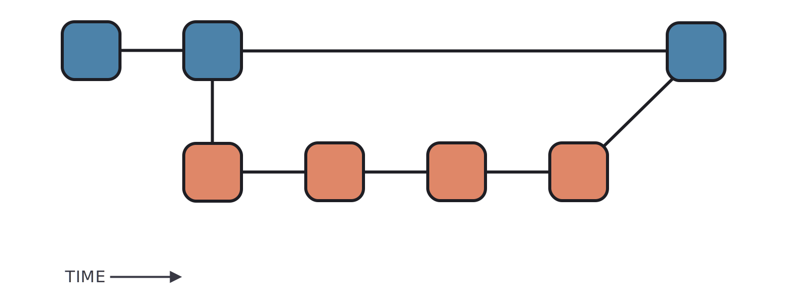
</div>

---
class: left

# Start a draft of another new idea

<div align="center" style="margin-bottom: 2em;">
  
</div>
---
class: center, middle, inverse-black

# Meal-prep flow

---
class: left

# Here is your wine glass

<div align="center" style="margin-bottom: 2em;">
  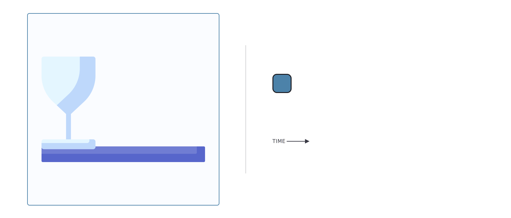
</div>

---
class: left

# Add wine to your wine glass

<div align="center" style="margin-bottom: 2em;">
  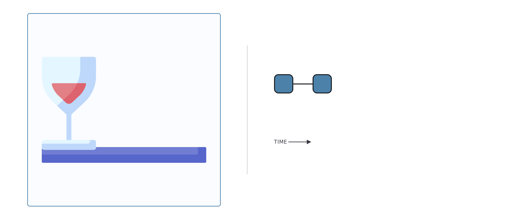
</div>

---
class: left

# Leave wine aside to prepare your salad

<div align="center" style="margin-bottom: 2em;">
  
</div>

---
class: left

# Add some greens to start your salad

<div align="center" style="margin-bottom: 2em;">
  
</div>

---
class: left

# Add onions and grapes to your salad

<div align="center" style="margin-bottom: 2em;">
  
</div>

---
class: left

# Replace the grapes with tomatoes

<div align="center" style="margin-bottom: 2em;">
  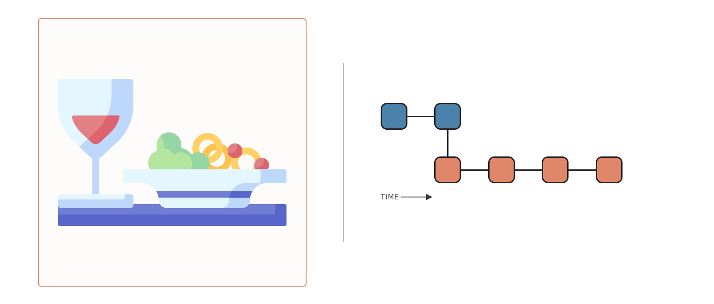
</div>

---
class: left

# Bring together your salad and wine

<div align="center" style="margin-bottom: 2em;">
  
</div>

---
class: left

# Start prepping another part of your meal

<div align="center" style="margin-bottom: 2em;">
  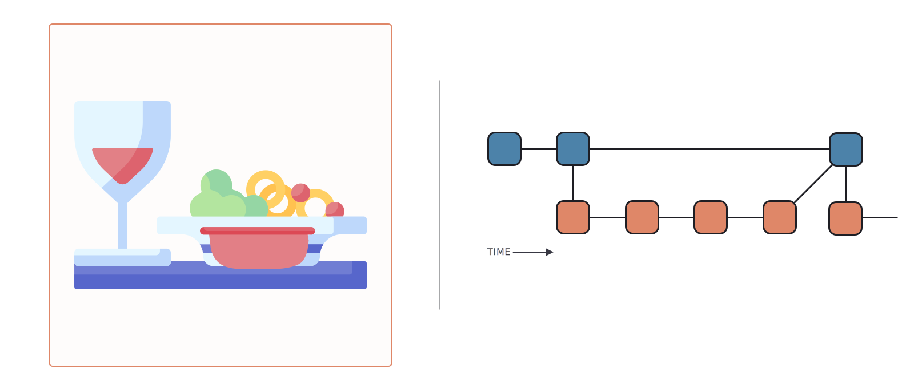
</div>

---
class: center, middle, inverse-black

# Online survey flow

---
class: left

# Here is a blank survey with a small title

<div align="center" style="margin-bottom: 2em;">
  
</div>

---
class: left

# Resize the title to increase readability

<div align="center" style="margin-bottom: 2em;">
  
</div>

---
class: left

# Draft the first set of questions separately

<div align="center" style="margin-bottom: 2em;">
  
</div>

---
class: left

# Add two questions to the survey draft

<div align="center" style="margin-bottom: 2em;">
  
</div>

---
class: left

# Add a third question to the survey draft

<div align="center" style="margin-bottom: 2em;">
  
</div>

---
class: left

# Replace the third question with a new version

<div align="center" style="margin-bottom: 2em;">
  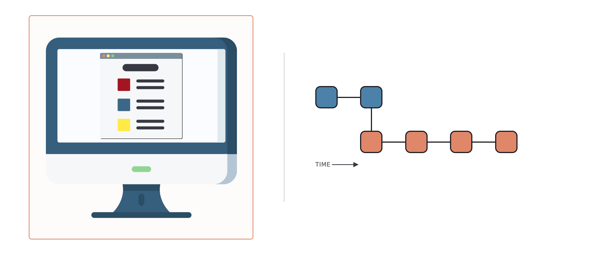
</div>

---
class: left

# Combine your questions with the title

<div align="center" style="margin-bottom: 2em;">
  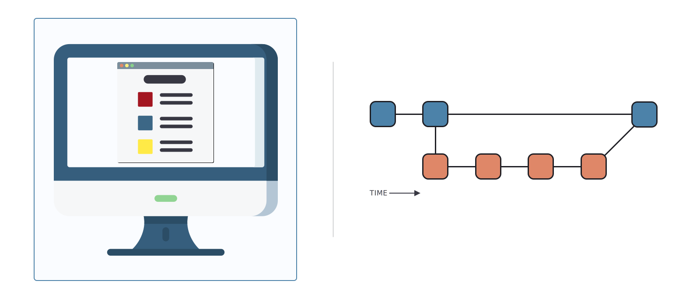
</div>

---
class: left

# Start drafting another section of the survey

<div align="center" style="margin-bottom: 2em;">
  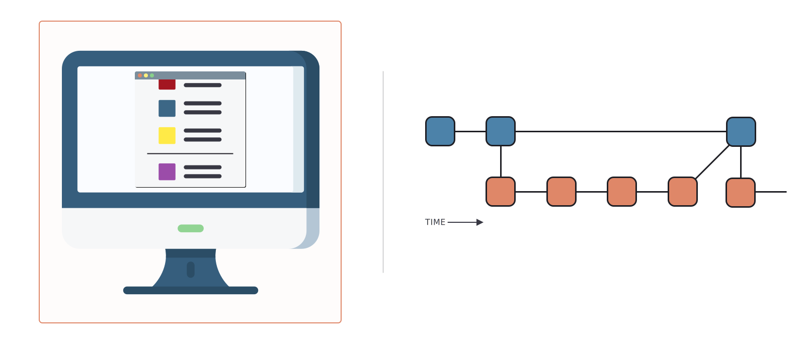
</div>

---
class: center, middle, inverse-black

# Online survey flow with Git terms

---
class: left

# The first survey version on the **main branch**

<div align="center" style="margin-bottom: 2em;">
  
</div>

---
class: left

# **Add**, **commit**, and **push** very minor changes

<div align="center" style="margin-bottom: 2em;">
  
</div>

---
class: left

# **Checkout** a draft branch to make major changes

<div align="center" style="margin-bottom: 2em;">
  
</div>

---
class: left

# **Add**, **commit**, and **push** changes to draft branch

<div align="center" style="margin-bottom: 2em;">
  
</div>

---
class: left

# **Add**, **commit**, and **push** changes to draft branch

<div align="center" style="margin-bottom: 2em;">
  
</div>

---
class: left

# **Add**, **commit**, and **push** changes to draft branch

<div align="center" style="margin-bottom: 2em;">
  
</div>

---
class: left

# **Merge** your draft branch into your main branch

<div align="center" style="margin-bottom: 2em;">
  
</div>

---
class: left

# **Checkout** a new branch to make more changes

<div align="center" style="margin-bottom: 2em;">
  
</div>

---
class: center

<div style="text-align: center;">
  `r icon_style(syl_images$github_logo, height = "3em")` 
</div>

# Again, how does GitHub work?

--

<div align="center" style="padding: 1em; margin-top: 2em; border: 0.1em solid #FFF07C; border-radius: 0.5em; background-color: #FFF9D1;">
  <h2>GitHub uses <i>Git</i> to help teams <b>develop</b> their ideas little by little, and documents <i>everything</i> thoughtfully.</h2>
  <br/>
  <h2><b>Flow:</b> Checkout > Add > Commit > Push > Merge</h2>
</div>

---
class: center, middle

# **Tools help teams accomplish best practices**

<div style="display: flex; flex-direction: column; justify-content: space-evenly; height: 9em; margin-top: 2em; margin-bottom: 2em; padding: 1em; background-color: #E8EFF4; border: 0.1em solid #5D8EB1; border-radius: 0.5em;">

<div style="display: flex; align-items: center; justify-content: space-evenly; width: 100%; margin-top: 1em;">
  <div style="display: inherit; flex-direction: column; align-items: center;">
    
    <h3>Slack</h3>
  </div>
  
  <div style="display: inherit; flex-direction: column; align-items: center;">
    
    <h3>Google Calendar</h3>
  </div>
  
  <div style="display: inherit; flex-direction: column; align-items: center;">
    
    <h3>GitHub</h3>
  </div>
</div>

</div>

---
class: center, middle, inverse

# How do we leverage modern tools as <br/> a lab? a department? a field?

---
class: center, middle

<div align="center" style="margin-bottom: 2em;">
  
</div>

---
class: center

<div align="center" style="margin-bottom: 2em;">
  
</div>

--

### Open-source platform that teaches academic research labs<br/>how to get started with modern tools for modern science

--

### Guides, tutorials, and templates focused on making<br/>team science more efficient, effective, and enjoyable

--

<div align="center" style="padding: 1em; padding-bottom: 2em; margin-top: 2em; border: 0.1em solid #5D8EB1; border-radius: 0.5em; background-color: #E8EFF4;">
  <h2>Let's take a look:</h2>
  <a href="https://www.startyourlab.com/" target="_blank">www.startyourlab.com</a>
</div>

---
class: left

# Next steps

1. Talk about best practices with your team

--

2. Plan! What are you going to do together?

--

3. Ask for support when you need or want it

--

4. Use [Start Your Lab](https://www.startyourlab.com/) to facilitate your lab's tool adoption
  - In development! Have questions, feedback, suggestions? [Let us know](mailto:feedback@startyourlab.com)!
  
---
class: left, inverse

# Final Messages

--

1. **This is about people.** Technology is the tool, but this is about learning and using conventions to help people work together more easily and effectively.

--

2. **It’s never too late to learn to use these tools, at any level of usage**. You can get plenty out of this even if you don’t do all the things.

--

3. **Yes, _we can_ do this.**

---
class: left

# Team acknowledgments

## Active team

- Dr. Peter Sokol-Hessner, Assistant Professor, University of Denver

## Industry advisors

- Austin Chustz, Full-Stack Software Engineer, [Fellow](https://www.meetfellow.com/)
- Ayush Sood, Engineering Manager, [Facebook for Developers](https://developers.facebook.com/)
- Aaron Rios, Data Scientist, [Even](http://even.com/)
- Ted Kornish, Head of Engineering, [TruthSet](https://www.truthset.io/)

---
class: center, middle, inverse

# **Questions?**

---
class: left

# Thank you!

- Icons made by [Freepik](https://www.freepik.com) from [Flaticon](https://www.flaticon.com/)
- Slides created via the R package [`xaringan`](https://github.com/yihui/xaringan)
- Site hosted on [GitHub Pages](https://pages.github.com/)
